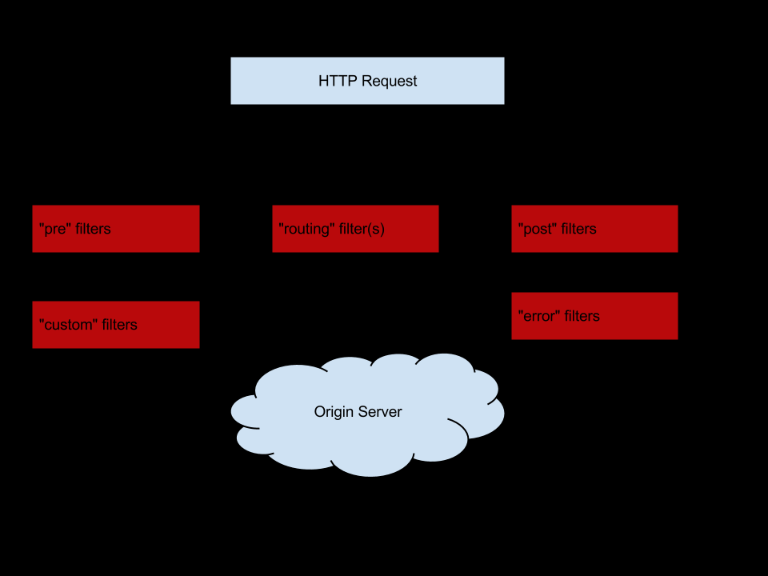

## **1. 过滤器**
在快速入门的请求过滤这一节的学习中，我们使用的pre类型的过滤器，那时我们就比较好奇：为什么不用route或其它类型？
实际上，路由运行过程中，它的路由映射和请求转发是由几个不同的过滤器完成的。其中，

pre类型的过滤器用于路由的映射，将请求路径和路由规则进行匹配，用以找到需要转发目标地址。
route类型的过滤器用来请求转发，从pre类型过滤器获取的目标地址进行转发。

在Spring Cloud Zuul 中实现过滤器必须包含4 个基本特征：过滤类型、执行顺序、执行条件、具体操作。实际上就是ZuulFilter抽象类中定义的抽象方法：
```
String filterType();
int filterOrder();
boolean shouldFilter();
Object run();
```
这里分别进行解释：
+ filterType：该方法需要返回一个字符串来代表过滤器的类型，而这个类型就是Zuul中的4种不同生命周期的过滤器类型，如下
    + pre：在请求到达路由前被调用
    + route：在路由请求时被调用
    + error： 处理请求时发生的错误时被调用
    + post：在route和error过滤器之后被调用，最后调用。
+ filterOrder：通过int值定义过滤器执行顺序，数值越小优先级越高
+ shouldFil``ter：返回布尔值来判断该过滤器是否执行。
+ run：过滤器的具体逻辑。可以在此确定是否拦截当前请求等。

##2. 请求的生命周期
    
和书的作者一样，我也去爬了下Zuul的官方wiki，这里我们简化梳理一下流程
    

首先HTTP请求到达Zuul，最先来到pre过滤器，在这里会去映射url patern到目标地址上，然后将请求与找到的地址交给route类型的过滤器进行求转发，请求服务实例获取响应，通过post类型过滤器对处理结果进行加工与转换等操作返回。error类型的过滤器比较特殊，在这整个请求过程中只要有异常才会触发，将异常结果交给post类型过滤器加工返回
    
    routing在filterType方法返回的类型是"route"，不是routing，查官方代码发现的
    
## 3. 禁用过滤器
说到禁用过滤器，第一想到的是自定义的过滤器中shouldFilter返回false，实际应用中，这样还需要重新编译代码。

Zuul贴心地提供了一个参数用来禁用指定过滤器，zuul.<过滤器名>.<过滤器类型>.disable=true

之前我们的实验必须headers中有accessToken才能通过AccessFilter，现在我们禁用一下试试
```
zuul: 
  AccessFilter:
    pre:
      disable: true          #禁用名为AccessFilter的过滤器
```

## 4. 动态加载
在微服务中，API网关担负着外部统一入口的重任，与其他服务不同，它必须保证不关闭不停机，从而确保整个系统的对外服务。所以我们就不能关机改东西再上线，这样会影响到其它服务。Zuul早已考虑了这点，它实现了不关机状态下的动态路由和动态添加/删除过滤器等功能。接下来我们分别来看看这些功能如何使用。
1. 动态路由
之前我们对于路由的规则控制几乎都是在application.yml或application.properties中完成的，网关服务不同于其它服务，需要不关闭不停机，所以这需要和Spring Cloud Config 组合起来，起到动态刷新配置路由的功能，这里简单说一下Config的工作原理，下一文会详细讲


